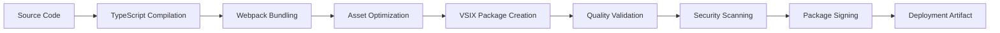

# Deployment and CI/CD Pipeline Guide

## 📋 Table of Contents

1. [Deployment Strategy](#deployment-strategy)
2. [Build Process](#build-process)
3. [CI/CD Pipeline](#cicd-pipeline)
4. [Release Management](#release-management)
5. [Environment Configuration](#environment-configuration)
6. [Quality Gates](#quality-gates)
7. [Monitoring & Rollback](#monitoring--rollback)
8. [Security Considerations](#security-considerations)

## 🎯 Deployment Strategy

### Overview

The Flutter Testing Keys Inspector extension follows a comprehensive deployment strategy that ensures quality, reliability, and seamless user experience through automated CI/CD pipelines.

### Deployment Environments

```
Development → Staging → Production
     ↓           ↓         ↓
   Feature    Integration  Release
   Testing     Testing     Testing
```

#### Development Environment
- **Purpose**: Feature development and initial testing
- **Trigger**: Pull request creation
- **Scope**: Unit tests, linting, basic integration tests
- **Deployment**: Automatic on PR

#### Staging Environment
- **Purpose**: Pre-production validation
- **Trigger**: Merge to `develop` branch
- **Scope**: Full test suite, E2E tests, performance testing
- **Deployment**: Automatic with manual approval gate

#### Production Environment
- **Purpose**: Live extension in VS Code Marketplace
- **Trigger**: Release tag creation
- **Scope**: Full validation, security scans, final approval
- **Deployment**: Automated with multiple approval gates

## 🏗️ Build Process

### Build Pipeline Architecture



### Build Scripts

#### Package.json Scripts
```json
{
  "scripts": {
    "vscode:prepublish": "npm run compile && npm run webpack",
    "compile": "tsc -p ./",
    "webpack": "webpack --mode production --devtool hidden-source-map",
    "package": "vsce package --out releases/",
    "publish": "vsce publish",
    "pretest": "npm run compile && npm run lint",
    "test": "node ./out/test/runTest.js",
    "test:coverage": "nyc npm test",
    "lint": "eslint src --ext ts",
    "lint:fix": "eslint src --ext ts --fix",
    "clean": "rimraf out releases coverage",
    "typecheck": "tsc --noEmit",
    "build:prod": "npm run clean && npm run compile && npm run webpack && npm run test && npm run package",
    "build:dev": "npm run compile && npm run test"
  }
}
```

#### Build Configuration

##### TypeScript Configuration (`tsconfig.json`)
```json
{
  "compilerOptions": {
    "module": "commonjs",
    "target": "ES2020",
    "outDir": "out",
    "lib": ["ES2020"],
    "sourceMap": true,
    "rootDir": "src",
    "strict": true,
    "esModuleInterop": true,
    "skipLibCheck": true,
    "forceConsistentCasingInFileNames": true,
    "declaration": true,
    "declarationMap": true
  },
  "exclude": ["node_modules", ".vscode-test"]
}
```

##### Webpack Configuration (`webpack.config.js`)
```javascript
const path = require('path');

module.exports = {
  target: 'node',
  mode: 'none',
  entry: './src/extension.ts',
  output: {
    path: path.resolve(__dirname, 'out'),
    filename: 'extension.js',
    libraryTarget: 'commonjs2'
  },
  externals: {
    vscode: 'commonjs vscode'
  },
  resolve: {
    extensions: ['.ts', '.js']
  },
  module: {
    rules: [
      {
        test: /\.ts$/,
        exclude: /node_modules/,
        use: [
          {
            loader: 'ts-loader'
          }
        ]
      }
    ]
  },
  devtool: 'nosources-source-map',
  infrastructureLogging: {
    level: "log"
  },
  optimization: {
    minimize: true
  }
};
```

## 🔄 CI/CD Pipeline

### GitHub Actions Workflows

#### Main CI/CD Workflow (`.github/workflows/ci-cd.yml`)

```yaml
name: CI/CD Pipeline

on:
  push:
    branches: [ main, develop ]
  pull_request:
    branches: [ main ]
  release:
    types: [ published ]

env:
  NODE_VERSION: '18.x'

jobs:
  # Quality Gates
  lint-and-typecheck:
    name: Lint and Type Check
    runs-on: ubuntu-latest
    steps:
      - uses: actions/checkout@v4
      
      - name: Setup Node.js
        uses: actions/setup-node@v4
        with:
          node-version: ${{ env.NODE_VERSION }}
          cache: 'npm'
      
      - name: Install dependencies
        run: npm ci
      
      - name: Run TypeScript compiler
        run: npm run typecheck
      
      - name: Run ESLint
        run: npm run lint
      
      - name: Check formatting
        run: npx prettier --check "src/**/*.ts"

  # Testing
  test:
    name: Test Suite
    strategy:
      matrix:
        os: [ubuntu-latest, windows-latest, macos-latest]
        node-version: [16.x, 18.x, 20.x]
    runs-on: ${{ matrix.os }}
    needs: lint-and-typecheck
    
    steps:
      - uses: actions/checkout@v4
      
      - name: Setup Node.js ${{ matrix.node-version }}
        uses: actions/setup-node@v4
        with:
          node-version: ${{ matrix.node-version }}
          cache: 'npm'
      
      - name: Install dependencies
        run: npm ci
      
      - name: Compile TypeScript
        run: npm run compile
      
      - name: Run tests
        run: npm test
        env:
          CI: true
      
      - name: Generate coverage report
        if: matrix.os == 'ubuntu-latest' && matrix.node-version == '18.x'
        run: npm run test:coverage
      
      - name: Upload coverage to Codecov
        if: matrix.os == 'ubuntu-latest' && matrix.node-version == '18.x'
        uses: codecov/codecov-action@v3
        with:
          file: ./coverage/lcov.info
          flags: unittests
          name: codecov-umbrella

  # Security Scanning
  security-scan:
    name: Security Scan
    runs-on: ubuntu-latest
    needs: lint-and-typecheck
    
    steps:
      - uses: actions/checkout@v4
      
      - name: Setup Node.js
        uses: actions/setup-node@v4
        with:
          node-version: ${{ env.NODE_VERSION }}
          cache: 'npm'
      
      - name: Install dependencies
        run: npm ci
      
      - name: Run security audit
        run: npm audit --audit-level=moderate
      
      - name: Run Snyk security scan
        uses: snyk/actions/node@master
        env:
          SNYK_TOKEN: ${{ secrets.SNYK_TOKEN }}
        with:
          args: --severity-threshold=high

  # Build and Package
  build:
    name: Build and Package
    runs-on: ubuntu-latest
    needs: [test, security-scan]
    
    steps:
      - uses: actions/checkout@v4
      
      - name: Setup Node.js
        uses: actions/setup-node@v4
        with:
          node-version: ${{ env.NODE_VERSION }}
          cache: 'npm'
      
      - name: Install dependencies
        run: npm ci
      
      - name: Build extension
        run: npm run build:prod
      
      - name: Upload VSIX artifact
        uses: actions/upload-artifact@v4
        with:
          name: extension-vsix
          path: releases/*.vsix
          retention-days: 30

  # Staging Deployment
  deploy-staging:
    name: Deploy to Staging
    runs-on: ubuntu-latest
    needs: build
    if: github.ref == 'refs/heads/develop'
    environment: staging
    
    steps:
      - uses: actions/checkout@v4
      
      - name: Download VSIX artifact
        uses: actions/download-artifact@v4
        with:
          name: extension-vsix
          path: releases/
      
      - name: Deploy to staging environment
        run: |
          echo "Deploying to staging environment..."
          # Custom staging deployment logic here
      
      - name: Run integration tests
        run: |
          echo "Running integration tests..."
          # Integration test execution

  # Production Deployment
  deploy-production:
    name: Deploy to Production
    runs-on: ubuntu-latest
    needs: build
    if: github.event_name == 'release' && github.event.action == 'published'
    environment: production
    
    steps:
      - uses: actions/checkout@v4
      
      - name: Setup Node.js
        uses: actions/setup-node@v4
        with:
          node-version: ${{ env.NODE_VERSION }}
          cache: 'npm'
      
      - name: Install dependencies
        run: npm ci
      
      - name: Download VSIX artifact
        uses: actions/download-artifact@v4
        with:
          name: extension-vsix
          path: releases/
      
      - name: Publish to VS Code Marketplace
        run: |
          npm install -g vsce
          vsce publish --packagePath releases/*.vsix
        env:
          VSCE_PAT: ${{ secrets.VSCE_PAT }}
      
      - name: Publish to Open VSX Registry
        run: |
          npm install -g ovsx
          ovsx publish releases/*.vsix
        env:
          OVSX_PAT: ${{ secrets.OVSX_PAT }}
      
      - name: Create GitHub Release
        uses: softprops/action-gh-release@v1
        with:
          files: releases/*.vsix
          generate_release_notes: true
        env:
          GITHUB_TOKEN: ${{ secrets.GITHUB_TOKEN }}
```

#### Dependency Update Workflow (`.github/workflows/dependency-update.yml`)

```yaml
name: Dependency Update

on:
  schedule:
    - cron: '0 0 * * 1' # Weekly on Monday
  workflow_dispatch:

jobs:
  update-dependencies:
    name: Update Dependencies
    runs-on: ubuntu-latest
    
    steps:
      - uses: actions/checkout@v4
        with:
          token: ${{ secrets.GITHUB_TOKEN }}
      
      - name: Setup Node.js
        uses: actions/setup-node@v4
        with:
          node-version: '18.x'
          cache: 'npm'
      
      - name: Update dependencies
        run: |
          npm update
          npm audit fix --force
      
      - name: Run tests
        run: |
          npm run compile
          npm test
      
      - name: Create Pull Request
        uses: peter-evans/create-pull-request@v5
        with:
          token: ${{ secrets.GITHUB_TOKEN }}
          commit-message: 'chore: update dependencies'
          title: 'Automated dependency update'
          body: |
            This PR updates project dependencies to their latest versions.
            
            - Dependencies have been updated using `npm update`
            - Security vulnerabilities have been fixed using `npm audit fix`
            - All tests are passing
          branch: automated-dependency-update
```

## 📦 Release Management

### Version Strategy

The project follows [Semantic Versioning](https://semver.org/):

- **MAJOR**: Breaking changes to VS Code API or extension behavior
- **MINOR**: New features, backward-compatible changes
- **PATCH**: Bug fixes, performance improvements

### Release Process

#### 1. Pre-Release Checklist
- [ ] All tests passing
- [ ] Documentation updated
- [ ] CHANGELOG.md updated
- [ ] Version bumped in package.json
- [ ] No security vulnerabilities
- [ ] Performance benchmarks met

#### 2. Release Creation
```bash
# Create release branch
git checkout -b release/v1.2.0

# Update version
npm version minor

# Push changes
git push origin release/v1.2.0

# Create pull request to main
# After approval and merge, create GitHub release
```

#### 3. Automated Release Script

```bash
#!/bin/bash
# scripts/release.sh

set -e

VERSION=$1
if [ -z "$VERSION" ]; then
  echo "Usage: $0 <version>"
  exit 1
fi

echo "Creating release $VERSION..."

# Quality checks
npm run lint
npm run typecheck
npm test
npm run test:coverage

# Build and package
npm run build:prod

# Verify package
VSIX_FILE="releases/flutter-testing-keys-inspector-$VERSION.vsix"
if [ ! -f "$VSIX_FILE" ]; then
  echo "Error: VSIX file not found at $VSIX_FILE"
  exit 1
fi

# Create git tag
git tag -a "v$VERSION" -m "Release version $VERSION"
git push origin "v$VERSION"

echo "Release $VERSION created successfully!"
echo "GitHub Actions will handle the marketplace deployment."
```

### Release Validation

#### Automated Checks
- **Unit Tests**: 100% pass rate required
- **Integration Tests**: All critical paths validated
- **Security Scan**: No high/critical vulnerabilities
- **Performance Tests**: Response time within SLA
- **Compatibility Tests**: VS Code versions 1.74.0+

#### Manual Validation
- **Functionality**: Core features working as expected
- **User Experience**: UI/UX validation
- **Documentation**: Accuracy and completeness
- **Migration**: Smooth upgrade from previous version

## ⚙️ Environment Configuration

### Environment Variables

#### Development
```bash
NODE_ENV=development
LOG_LEVEL=debug
ENABLE_SOURCE_MAPS=true
MOCK_SERVICES=true
```

#### Staging
```bash
NODE_ENV=staging
LOG_LEVEL=info
ENABLE_TELEMETRY=true
PERFORMANCE_MONITORING=true
```

#### Production
```bash
NODE_ENV=production
LOG_LEVEL=warn
ENABLE_TELEMETRY=true
PERFORMANCE_MONITORING=true
ERROR_REPORTING=true
```

### Configuration Management

#### VS Code Extension Configuration
```json
{
  "contributes": {
    "configuration": {
      "properties": {
        "flutterTestingKeys.environment": {
          "type": "string",
          "enum": ["development", "staging", "production"],
          "default": "production",
          "description": "Extension environment"
        }
      }
    }
  }
}
```

## 🚦 Quality Gates

### Automated Quality Gates

#### Gate 1: Code Quality
- **ESLint**: No errors, warnings as per configuration
- **TypeScript**: Strict type checking, no compilation errors
- **Prettier**: Code formatting compliance
- **Coverage**: Minimum 80% code coverage

#### Gate 2: Testing
- **Unit Tests**: 100% pass rate
- **Integration Tests**: All critical flows tested
- **E2E Tests**: User scenarios validated
- **Performance Tests**: Response time SLA met

#### Gate 3: Security
- **Dependency Scan**: No high/critical vulnerabilities
- **Code Analysis**: SAST (Static Application Security Testing)
- **License Compliance**: Compatible licenses only
- **Secret Detection**: No hardcoded secrets

#### Gate 4: Build Quality
- **Package Size**: Under defined limits
- **Bundle Analysis**: No unused dependencies
- **Asset Optimization**: Images and resources optimized
- **Compatibility**: VS Code API compatibility verified

### Manual Quality Gates

#### Code Review Process
1. **Peer Review**: At least one approval required
2. **Architecture Review**: For significant changes
3. **Security Review**: For security-related changes
4. **UX Review**: For user-facing changes

#### Release Approval
1. **QA Sign-off**: Manual testing completion
2. **Product Owner**: Feature completeness validation
3. **Security Team**: Security assessment (if applicable)
4. **Release Manager**: Final deployment approval

## 📊 Monitoring & Rollback

### Deployment Monitoring

#### Health Checks
```typescript
// Extension health monitoring
export class HealthMonitor {
    private static instance: HealthMonitor;
    
    public static getInstance(): HealthMonitor {
        if (!HealthMonitor.instance) {
            HealthMonitor.instance = new HealthMonitor();
        }
        return HealthMonitor.instance;
    }
    
    public async checkHealth(): Promise<HealthStatus> {
        const checks = await Promise.allSettled([
            this.checkServiceAvailability(),
            this.checkPerformanceMetrics(),
            this.checkErrorRates(),
            this.checkResourceUsage()
        ]);
        
        return this.aggregateHealthStatus(checks);
    }
}
```

#### Performance Metrics
- **Extension Activation Time**: < 2 seconds
- **Command Response Time**: < 500ms
- **Memory Usage**: < 50MB
- **CPU Usage**: < 5% average

#### Error Monitoring
- **Error Rate**: < 1% of operations
- **Critical Errors**: 0 tolerance
- **Recovery Success Rate**: > 95%
- **User-Reported Issues**: Response within 24 hours

### Rollback Strategy

#### Automatic Rollback Triggers
- **Error Rate Spike**: > 5% error rate for 10 minutes
- **Performance Degradation**: > 2x slower response times
- **Critical Bug**: Severity 1 issues affecting core functionality
- **User Complaints**: Significant increase in support tickets

#### Rollback Process
```bash
#!/bin/bash
# scripts/rollback.sh

PREVIOUS_VERSION=$1
REASON=$2

echo "Initiating rollback to version $PREVIOUS_VERSION"
echo "Reason: $REASON"

# Unpublish current version from marketplace
vsce unpublish

# Republish previous version
vsce publish --packagePath "releases/previous/$PREVIOUS_VERSION.vsix"

# Notify stakeholders
echo "Rollback completed. Previous version $PREVIOUS_VERSION is now live."
```

## 🔒 Security Considerations

### Security Best Practices

#### Secrets Management
- **GitHub Secrets**: Store sensitive tokens and keys
- **Environment Variables**: Runtime configuration
- **No Hardcoded Secrets**: Automated scanning prevents commits
- **Key Rotation**: Regular rotation of access tokens

#### Access Control
- **Branch Protection**: Require PR reviews for main/develop
- **Environment Protection**: Manual approval for production deployments
- **Team Permissions**: Least privilege access model
- **Audit Logging**: Track all deployment activities

#### Security Scanning

##### Dependency Scanning
```yaml
- name: Run Snyk security scan
  uses: snyk/actions/node@master
  env:
    SNYK_TOKEN: ${{ secrets.SNYK_TOKEN }}
  with:
    args: --severity-threshold=high
```

##### Code Scanning
```yaml
- name: Initialize CodeQL
  uses: github/codeql-action/init@v2
  with:
    languages: typescript

- name: Perform CodeQL Analysis
  uses: github/codeql-action/analyze@v2
```

### Compliance and Auditing

#### Compliance Requirements
- **License Compliance**: MIT license compatibility
- **Privacy**: No personal data collection without consent
- **Accessibility**: WCAG 2.1 AA compliance
- **Data Protection**: GDPR compliance for EU users

#### Audit Trail
- **Deployment History**: Complete record of all deployments
- **Change Management**: Tracked changes with approval records
- **Security Events**: Monitoring and alerting for security issues
- **Performance Monitoring**: Continuous performance tracking

---

This comprehensive deployment and CI/CD guide ensures the Flutter Testing Keys Inspector extension maintains high quality, security, and reliability throughout its development and deployment lifecycle.