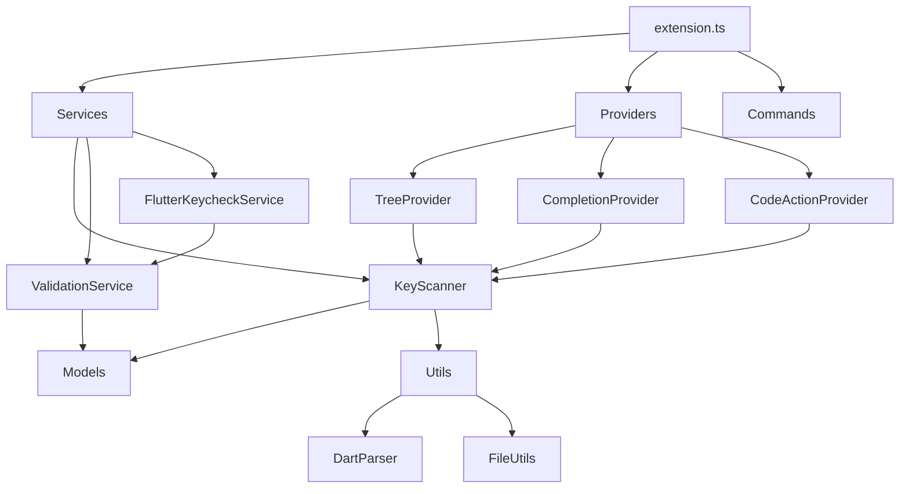

# Flutter Testing Keys Inspector - Project Index

## 📁 Project Structure Overview

```
flutter_keycheck_extension/
├── 📄 Core Documentation
│   ├── README.md                    # Main project documentation
│   ├── PROJECT_DOCUMENTATION.md     # Comprehensive project guide
│   ├── API_DOCUMENTATION.md         # API reference
│   ├── PROJECT_INDEX.md            # This file - project navigation
│   ├── CHANGELOG.md                # Version history
│   ├── CONTRIBUTING.md             # Contribution guidelines
│   ├── LICENSE                     # MIT License
│   ├── PUBLISHING.md               # Publishing guide
│   └── QUICK_START.md              # Quick start guide
│
├── 📦 Source Code (src/)
│   ├── extension.ts                # Main entry point
│   ├── 📂 models/                  # Data models
│   │   ├── keyValidation.ts        # Validation models
│   │   └── testingKey.ts           # Key data structures
│   ├── 📂 providers/               # VS Code providers
│   │   ├── codeActionProvider.ts   # Quick fixes
│   │   ├── completionProvider.ts   # Auto-completion
│   │   └── keyTreeProvider.ts      # Tree view
│   ├── 📂 services/                # Core business logic
│   │   ├── flutterKeycheckService.ts # CLI integration
│   │   ├── keyScanner.ts           # Key discovery
│   │   └── validationService.ts    # Validation engine
│   ├── 📂 utils/                   # Helper utilities
│   │   ├── dartParser.ts           # Dart code parsing
│   │   └── fileUtils.ts            # File operations
│   └── 📂 test/                    # Test suites
│       ├── runTest.ts              # Test runner
│       └── suite/                  # Test cases
│
├── 📂 Configuration
│   ├── package.json                # Extension manifest
│   ├── tsconfig.json               # TypeScript config
│   ├── webpack.config.js           # Build configuration
│   └── .vscode/                    # VS Code settings
│
├── 📂 SuperClaude Framework
│   └── SuperClaude_Framework/      # Development framework
│       ├── README.md               # Framework overview
│       ├── Docs/                   # Framework guides
│       └── SuperClaude/            # Framework modules
│
└── 📂 Resources
    └── resources/
        └── icon.svg                # Extension icon
```

## 🗂️ Quick Navigation

### Essential Files

| File | Purpose | Link |
|------|---------|------|
| Main Entry | Extension activation and setup | [extension.ts](src/extension.ts) |
| Package Manifest | Extension configuration | [package.json](package.json) |
| Project Docs | Comprehensive documentation | [PROJECT_DOCUMENTATION.md](PROJECT_DOCUMENTATION.md) |
| API Reference | Complete API documentation | [API_DOCUMENTATION.md](API_DOCUMENTATION.md) |

### Core Components

#### Services
- **[KeyScanner](src/services/keyScanner.ts)** - Discovers and catalogs testing keys
- **[ValidationService](src/services/validationService.ts)** - Validates key usage and conventions
- **[FlutterKeycheckService](src/services/flutterKeycheckService.ts)** - CLI tool integration

#### Providers
- **[KeyTreeProvider](src/providers/keyTreeProvider.ts)** - Tree view in Explorer panel
- **[CompletionProvider](src/providers/completionProvider.ts)** - Smart auto-completion
- **[CodeActionProvider](src/providers/codeActionProvider.ts)** - Quick fixes and refactoring

#### Models
- **[TestingKey](src/models/testingKey.ts)** - Key data structures and enums
- **[KeyValidation](src/models/keyValidation.ts)** - Validation result models

#### Utilities
- **[DartParser](src/utils/dartParser.ts)** - Parses Dart code for keys
- **[FileUtils](src/utils/fileUtils.ts)** - File system operations

### Documentation

| Document | Description |
|----------|-------------|
| [README.md](README.md) | User-facing documentation with features and usage |
| [PROJECT_DOCUMENTATION.md](PROJECT_DOCUMENTATION.md) | Technical architecture and development guide |
| [API_DOCUMENTATION.md](API_DOCUMENTATION.md) | Complete API reference for all components |
| [CONTRIBUTING.md](CONTRIBUTING.md) | Guidelines for contributors |
| [CHANGELOG.md](CHANGELOG.md) | Version history and changes |

## 🔍 Component Relationships



## 📊 Key Features Map

### Visual Tree View
- **Component**: KeyTreeProvider
- **Location**: [src/providers/keyTreeProvider.ts](src/providers/keyTreeProvider.ts)
- **Commands**: refresh, goToDefinition

### Smart Auto-completion
- **Component**: CompletionProvider
- **Location**: [src/providers/completionProvider.ts](src/providers/completionProvider.ts)
- **Triggers**: ".", "("

### Code Actions
- **Component**: CodeActionProvider
- **Location**: [src/providers/codeActionProvider.ts](src/providers/codeActionProvider.ts)
- **Actions**: Replace hardcoded keys, add imports, create constants

### Validation Engine
- **Component**: ValidationService
- **Location**: [src/services/validationService.ts](src/services/validationService.ts)
- **Features**: Naming conventions, usage tracking, duplicate detection

### CLI Integration
- **Component**: FlutterKeycheckService
- **Location**: [src/services/flutterKeycheckService.ts](src/services/flutterKeycheckService.ts)
- **Features**: External validation, performance optimization

## 🛠️ Development Workflow

### Setup
1. Clone repository
2. Install dependencies: `npm install`
3. Start development: `npm run watch`
4. Debug: Press F5 in VS Code

### Key Scripts
- `npm run compile` - Compile TypeScript
- `npm run watch` - Watch mode development
- `npm test` - Run test suite
- `npm run package` - Build VSIX package
- `npm run lint` - Run ESLint

### Testing
- Unit tests: [src/test/suite/extension.test.ts](src/test/suite/extension.test.ts)
- Test runner: [src/test/runTest.ts](src/test/runTest.ts)
- Run tests: `npm test`

## 🚀 Quick Links

### User Documentation
- [Installation Guide](README.md#-quick-start)
- [Configuration Options](README.md#️-configuration)
- [Best Practices](README.md#-best-practices)
- [Troubleshooting](README.md#-troubleshooting)

### Developer Resources
- [Architecture Overview](PROJECT_DOCUMENTATION.md#️-architecture)
- [API Reference](API_DOCUMENTATION.md)
- [Contributing Guide](CONTRIBUTING.md)
- [SuperClaude Framework](SuperClaude_Framework/README.md)

### External Links
- [VS Code Extension API](https://code.visualstudio.com/api)
- [Flutter Documentation](https://flutter.dev/docs)
- [TypeScript Documentation](https://www.typescriptlang.org/docs/)

## 📈 Project Statistics

- **Language**: TypeScript (100%)
- **Dependencies**: 11 dev dependencies
- **VS Code Version**: ^1.74.0
- **Node Version**: 16.x
- **License**: MIT

## 🎯 Feature Matrix

| Feature | Status | Component | Priority |
|---------|--------|-----------|----------|
| Key Discovery | ✅ Complete | KeyScanner | High |
| Tree View | ✅ Complete | KeyTreeProvider | High |
| Auto-completion | ✅ Complete | CompletionProvider | High |
| Validation | ✅ Complete | ValidationService | High |
| Quick Fixes | ✅ Complete | CodeActionProvider | Medium |
| CLI Integration | ✅ Complete | FlutterKeycheckService | Medium |
| Report Generation | ✅ Complete | ValidationService | Low |
| Multi-workspace | 🔄 Planned | All | Low |

---

## 📞 Support

For questions, issues, or contributions:
- 🐛 [Report Issues](https://github.com/your-username/flutter-testing-keys-inspector/issues)
- 💡 [Feature Requests](https://github.com/your-username/flutter-testing-keys-inspector/issues/new)
- 💬 [Discussions](https://github.com/your-username/flutter-testing-keys-inspector/discussions)
- 📖 [Wiki](https://github.com/your-username/flutter-testing-keys-inspector/wiki)